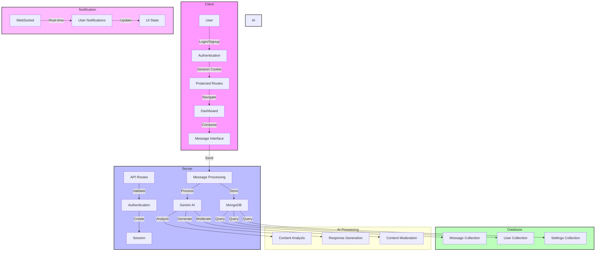

# Whisper - Anonymous Messaging Platform

## 📝 Description

Whisper is a modern web application that enables users to send anonymous messages. It is built using Next.js, MongoDB, and Google Gemini AI. The platform provides a secure and private way for users to communicate while maintaining their anonymity. The application features real-time message delivery, AI-powered message processing, and a modern, responsive user interface.

## 🚀 Technology Stack

### Frontend

- **Framework**: Next.js 15.3.3
- **UI Library**: React 19
- **Styling**: Tailwind CSS
- **Component Library**: Radix UI
- **State Management**: React Hooks
- **Animation**: Motion, Embla Carousel
- **Icons**: Tabler Icons, Lucide React

### Backend

- **Runtime**: Node.js
- **API Framework**: Next.js API Routes
- **Database**: MongoDB with Mongoose ODM
- **Authentication**: Better-Auth
- **AI Integration**: Google Gemini AI
- **HTTP Client**: Axios

### Development Tools

- **Package Manager**: npm
- **Build Tool**: Turbopack
- **Linting**: ESLint
- **Type Checking**: TypeScript

## 📁 Detailed Folder Structure

```
whisper/
├── app/                    # Next.js app routes and layouts
│   ├── api/               # API endpoints
│   │   ├── auth/         # Authentication endpoints
│   │   ├── messages/     # Message handling endpoints
│   │   └── settings/     # User settings endpoints
│   ├── (routes)/         # Page routes
│   │   ├── dashboard/    # User dashboard
│   │   ├── messages/     # Message interface
│   │   └── settings/     # User settings
│   └── (auth)/           # Authentication related pages
│       ├── login/        # Login page
│       └── signup/       # Signup page
├── components/            # Reusable components
│   ├── ui/               # UI components
│   │   ├── button/      # Button components
│   │   ├── input/       # Input components
│   │   └── modal/       # Modal components
│   ├── features-section/ # Feature showcase
│   ├── hero-section/    # Landing page hero
│   ├── navbar/          # Navigation bar
│   ├── footer/          # Page footer
│   └── magicui/         # Animated UI components
├── db/                    # Database connection
│   └── mongodb.js        # MongoDB connection setup
├── helper/               # Helper functions
│   └── gemini.js         # Gemini AI integration
├── lib/                  # Utility functions
│   └── utils.js          # General utilities
├── model/                # MongoDB models
│   ├── message.model.js  # Message schema
│   └── settings.model.js # User settings schema
└── utils/                # General utilities
    ├── auth.js           # Authentication utilities
    └── auth-client.js    # Client-side auth helpers
```

## 🔄 Detailed Data Flow

### 1. Authentication Flow

1. **User Registration**:

   - User enters credentials on signup page
   - Client-side validation of input
   - API request to `/api/auth/signup`
   - Server validates and creates user
   - Session cookie generated
   - Redirect to dashboard

2. **User Login**:

   - User enters credentials
   - API request to `/api/auth/login`
   - Server validates credentials
   - Session cookie generated
   - Redirect to dashboard

3. **Session Management**:
   - Middleware checks session cookie
   - Validates token on protected routes
   - Handles session expiration
   - Manages refresh tokens

### 2. Messaging Flow

1. **Message Creation**:

   - User composes message
   - Client-side validation
   - API request to `/api/messages/create`
   - Message stored in MongoDB
   - AI processing initiated

2. **AI Processing**:

   - Message sent to Gemini AI
   - Content analysis performed
   - Sentiment analysis
   - Content moderation
   - Response generation

3. **Message Delivery**:
   - Real-time notification to receiver
   - Message stored in receiver's inbox
   - Read status tracking
   - Message history maintenance

### 3. Settings Management

1. **User Preferences**:

   - Notification settings
   - Privacy settings
   - Theme preferences
   - Language settings

2. **Account Management**:
   - Profile updates
   - Password changes
   - Account deletion
   - Session management

## 🔒 Security Features

### Authentication Security

- JWT-based authentication
- Secure session management
- CSRF protection
- Rate limiting
- Password hashing

### Data Security

- End-to-end encryption
- Secure API endpoints
- Input sanitization
- XSS protection
- SQL injection prevention

### Infrastructure Security

- MongoDB security
- Environment variable protection
- CORS configuration
- HTTPS enforcement
- Regular security audits

## 🛠️ Setup and Installation

1. **Prerequisites**:

   - Node.js 18+
   - MongoDB 6.0+
   - npm or yarn
   - Git

2. **Clone the repository**:

```bash
git clone [repository-url]
cd whisper
```

3. **Install dependencies**:

```bash
npm install
```

4. **Environment Setup**:
   Create a `.env.local` file with:

```env
MONGODB_URI=your_mongodb_uri
GEMINI_API_KEY=your_gemini_api_key
NEXTAUTH_SECRET=your_nextauth_secret
NEXTAUTH_URL=http://localhost:3000
```

5. **Database Setup**:

```bash
# Start MongoDB (if running locally)
mongod --dbpath /path/to/data/db
```

6. **Start Development Server**:

```bash
npm run dev
```

## 📊 Detailed Application Flow Diagram



## 🤝 Contributing

1. **Fork the repository**
2. **Create your feature branch**:

```bash
git checkout -b feature/AmazingFeature
```

3. **Commit your changes**:

```bash
git commit -m 'Add some AmazingFeature'
```

4. **Push to the branch**:

```bash
git push origin feature/AmazingFeature
```

5. **Open a Pull Request**

### Development Guidelines

- Follow the existing code style
- Write meaningful commit messages
- Add tests for new features
- Update documentation
- Ensure all tests pass

## 📄 License

Distributed under the MIT License. See `LICENSE` for more information.

## 📞 Support

For support, email support@whisper.com or join our Slack channel.
